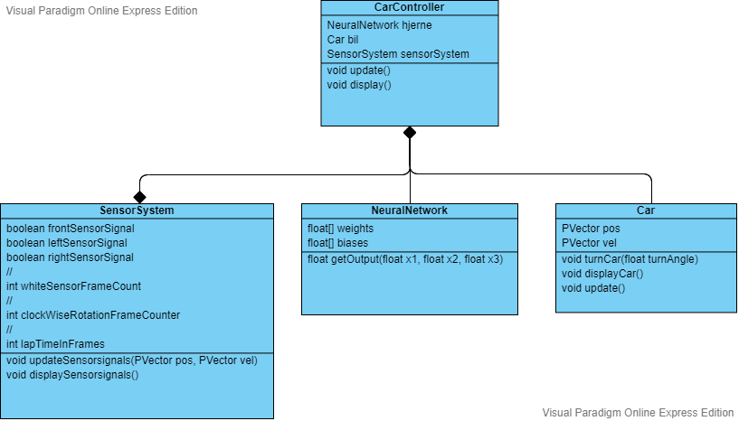

# Racerbils Neuro Evolution

### Klassediagram over den autonome racerbil
Nedenfor ses et klassediagram for vigtigste dele af "den autonome racerbil", i koden kaldet "CarController":  

### Racerbilen grafiske visning
Nedenfor ses en racerbil som den ser ud i programmet. Den højre sensor har detekteret den hvide farve og lyser rødt:

## Oversigt over vigitigste klasser i programmet

### CarController:
Den autonome bil. Indeholder et SensorSystem, et NeuraltNetwork og en Car: 
CarControlleren fodrer NeuraltNetwork  med signaler fra SensorSystem’s left/right/front/sensor.  
Det neurale netværks output styrer bilen. 
### Car:
Bilen. Hastigheden er konstant 5 pixels/frame. Kan kun dreje/rotere enten til venstre eller højre.  
### SensorSystem:
Sensorer. Til at styre en bil og udregne fitness. Indeholder følge vigtige målinger: 
**whiteSensorFrameCount:**  Antal frames bilen er i det hvide område uden for banen 
**frontSensorSignal & leftSensorSignal & rightSensorSignal:** Detektion af hvidt, 50 pixels foran bilen. 
**clockWiseRotationFrameCounter:** Antal frames kørt  “i urets retning”. 
**lapTimeInFrames:** Antal frames bilen bruger inden den kører over den grønne streg. 
### NeuralNetwork: 
Hjernen. Et simpelt netværk 3 input-, 2 mellem-lags- og 1 output-neuroner.  
